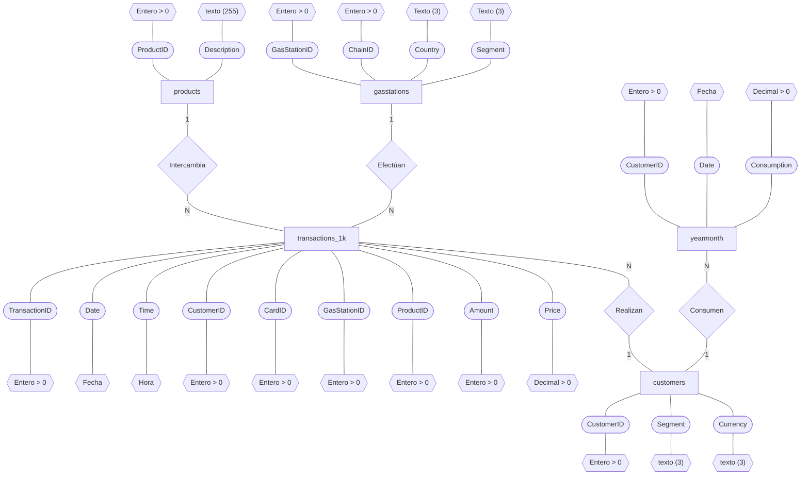

# **Tarea 2**

## **Modelo Entidad-Relación de la Base de Datos elegida**

Se utilizó [MySQL Workbench](https://www.mysql.com/products/workbench/) para descargar y visualizar la base de datos elegida ([CCS](https://relational.fit.cvut.cz/dataset/CCS)). Se optó por omitir la tabla de "transactions" ya que está vacía, utilizando en su lugar "transactions_1k". Asimismo, se diseñó el diagrama entidad-relación con el apoyo de la herramienta [Mermaid](https://mermaid.live/), resultando de la siguiente manera:

