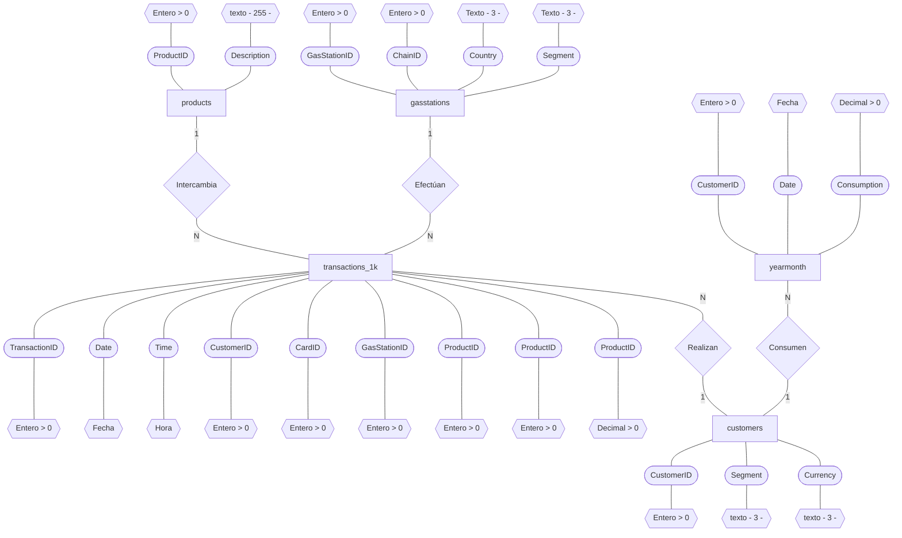

# **Tarea 2**

## **Parte 1: Elección de Base de datos**

```mermaid
flowchart BT
    d1{{Entero > 0}} --- a1([TransactionID])--- transactions_1k
    d2{{Fecha}} --- a2([Date])--- transactions_1k
    d3{{Hora}} --- a3([Time]) ---transactions_1k
    d4{{Entero > 0}}--- a4([CustomerID]) --- transactions_1k
    d5{{Entero > 0}}--- a5([CardID]) --- transactions_1k
    d6{{Entero > 0}}--- a6([GasStationID])---transactions_1k
    d7{{Entero > 0}}--- a7([ProductID])---transactions_1k
    d8{{Entero > 0}}--- a8([ProductID])---transactions_1k
    d9{{Decimal > 0}}--- a9([ProductID])---transactions_1k

    transactions_1k---|N|r1{Intercambia}---|1|products
    products---a10([ProductID])---d10{{Entero > 0}}
    products---a11([Description])---d11{{texto - 255 -}}

    customers---|1|r2{Realizan}---|N|transactions_1k
    d12{{Entero > 0}}---a12([CustomerID])---customers
    d13{{texto - 3 -}}---a13([Segment])---customers
    d14{{texto - 3 -}}---a14([Currency])---customers

    customers---|1|r3{Consumen}---|N|yearmonth
    yearmonth---a15([CustomerID])---d15{{Entero > 0}}
    yearmonth---a16([Date])---d16{{Fecha}}
    yearmonth---a17([Consumption])---d17{{Decimal > 0}}

    transactions_1k---|N|r4{Efectúan}---|1|gasstations
    gasstations---a18([GasStationID])---d18{{Entero > 0}}
    gasstations---a19([ChainID])---d19{{Entero > 0}}
    gasstations---a20([Country])---d20{{Texto - 3 -}}
    gasstations---a21([Segment])---d21{{Texto - 3 -}}
```