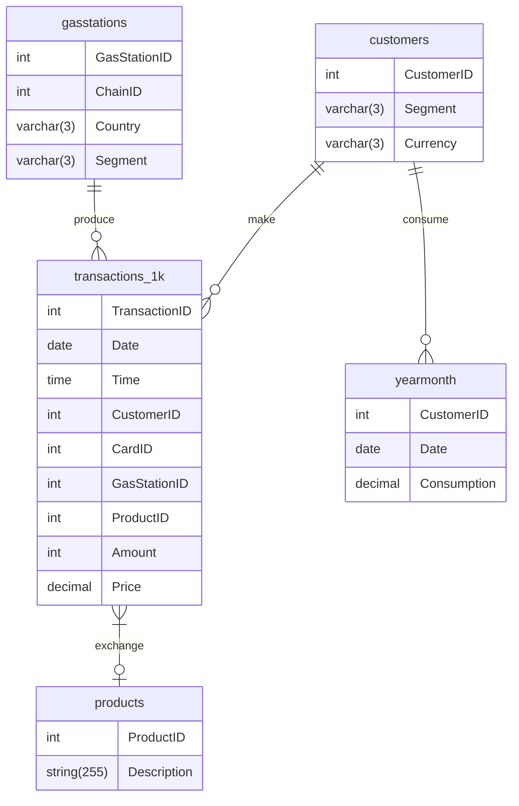

# **Tarea 3**

## **Parte 1: Esquema del modelo relacional**

1. customers(**CustomerID**, Segment, Currency)
2. yearmonth(_CustomerID_, _Date_, Consumption)
3. products(**ProductID**, Description)
4. gasstations(**GasStationID**, ChainID, Country, Segment)
5. transactions_1k(**TransactionID**, Date, Time, _CustomerID_, CardID, _GasStationID_, _ProductID_, Amount, Price)

## **Parte 2: Diagrama relacional**

## **Parte 3: Álgebra Relacional**

Se identifican cuatro operaciones que se pueden utilizar en la base de datos seleccionada para el curso:

1. Obtener los montos transaccionados a partir de una fecha.

πPrice(σ Date > XX/XX/XXXX(transactions_1k))

*Se selecciona el precio del resultado de filtrar las transacciones realizadas después de una fecha en la tabla transactions_1k.*

2. Identificar las estaciones de gas en cierto país.

πGasStationID(σ Country = X (gasstation))

*Se proyecta el ID de las gasolineras seleccionadas por pertenecer al país X en la tabla gasstation.*

3. Obtener el precio de todas las transacciones que se han realizado para cierto producto en una gasolinera en particular.

πPrice(σ((σ GasStationID=X).ProductID = Y ))(transactions_1k)

*Se proyecta el precio de la tabla resultante de seleccionar las transacciones con el ProductID=Y después de haber filtrado las transacciones realizadas en la GasStationID=X de la tabla transactions_1k.*

4. Obtener el consumo en cualquier fecha del cliente X.
πConsumption(σ CustomerID=X(yearmonth))

_Como no importa la fecha del registro, se proyecta el consumo filtrando solo por el CustomerID._